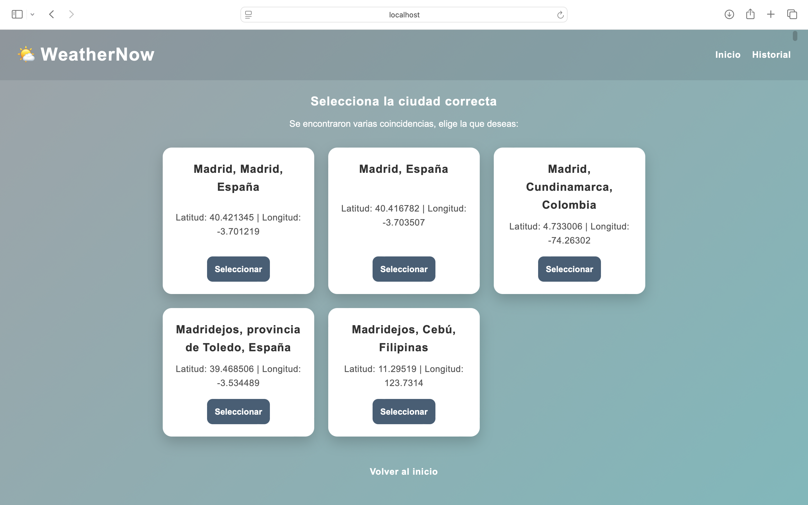
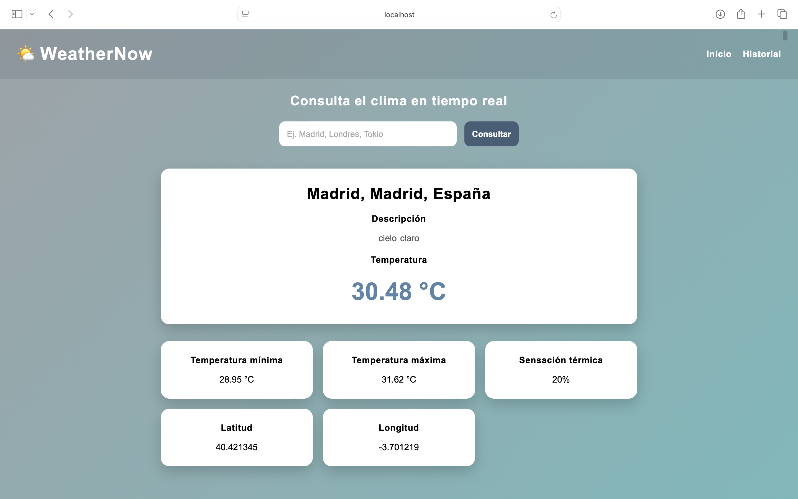

# 🌦️ WeatherWebServer

Aplicación web desarrollada con **Node.js** y **Express** que permite consultar información meteorológica en tiempo real mediante una API externa.

## 🚀 Características

* Consulta del clima por ciudad.
* Obtención de datos meteorológicos en tiempo real.
* Interfaz web amigable.
* Arquitectura organizada utilizando Express.
* Manejo de variables de entorno para proteger credenciales.

## 🛠️ Tecnologías utilizadas

* Node.js
* Express.js
* JavaScript
* HTML
* CSS
* API de clima
* Git & GitHub

## 📸 Screenshots

### Home


### Search


### Result


### History


## 📂 Estructura del proyecto

```text
ClimaWebServer/
├── db/
├── js/
├── modelos/
├── public/
├── views/
├── app.js
├── package.json
└── .gitignore
```

## ⚙️ Instalación

Clona el repositorio:

```bash
git clone https://github.com/marianadehesa/WeatherWebServer.git
```

Instala las dependencias:

```bash
npm install
```

Configura las variables de entorno creando un archivo `.env`.

Inicia la aplicación:

```bash
npm start
```

## 📚 Aprendizajes

Este proyecto me permitió reforzar conocimientos sobre:

* Desarrollo Backend con Node.js.
* Consumo de APIs REST.
* Manejo de variables de entorno.
* Control de versiones con Git y GitHub.
* Organización de proyectos web con Express.

## 👩‍💻 Autora

**Mariana Dehesa**

Estudiante de Ingeniería de Software.

